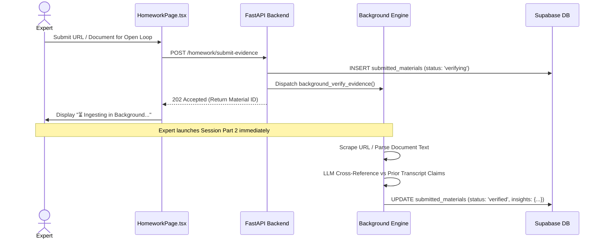

# AI Journalist Digital Twin — System Design Specification

## Overview
This document defines the technical architecture, data models, state machines, and API contracts required to fulfill the **Weekly Requirements Specification** covering the **Homework Ledger**, **Structured Knowledge Extraction Engine**, and **Session Management Framework**.

---

## 1. Architectural Blueprint & Component Topology

```mermaid
graph TD
    subgraph Frontend Studio (Vite / React)
        IP[InterviewPage.tsx<br/>Teleprompter & Live Feed]
        HP[HomeworkPage.tsx<br/>Evidence Submission & Open Loops]
        LP[LoginPage.tsx<br/>Auto-Resume Handshake]
    end

    subgraph Backend Engine (FastAPI / Python)
        API[app.py<br/>REST & WebSocket Endpoints]
        ID[domains/interview.py<br/>Domain State & Synthesis]
        BG[Background Verification Tasks<br/>Asynchronous LLM Workers]
    end

    subgraph Storage & Vector State (Supabase / Postgres)
        SESS[(interview_sessions<br/>State & Snapshots)]
        MAT[(submitted_materials<br/>Evidence & Fact Checks)]
        HW[(homework_ledger<br/>AI Open Loops)]
        VEC[(knowledge_sources<br/>PGVector Memory)]
    end

    IP <-->|WS SESS-DEMO| API
    HP -->|POST /submit-evidence| API
    LP -->|GET /sessions/active| API
    API <--> ID
    API --> BG
    BG -->|Upsert Fact-Check| MAT
    ID -->|Extract 7 Slots| HW
    ID -->|Auto-Spawn Part 2| SESS
    ID -->|Embed Memory| VEC
```

---

## 2. Database Schema & Data Models (ERD)

### 2.1 `interview_sessions` (Session Management)
Tracks the lifecycle of each interview chapter.
* **`id`** *(UUID, PK)*: Unique session identifier.
* **`expert_id`** *(Text, FK $\rightarrow$ experts)*: Authenticated expert owner.
* **`iteration_number`** *(Int)*: Chapter number ($1, 2, 3\dots$).
* **`status`** *(Text)*: State machine enum (`active`, `paused`, `completed`, `synthesized`).
* **`script`** *(JSONB)*: Curriculum blueprint containing themes and questions.
* **`snapshot`** *(JSONB)*: Exact 2D teleprompter pointer state (`active_block`, `current_script_question`, `tangent_count`, `satisfied_objectives`).
* **`session_synthesis`** *(JSONB)*: Extracted tacit insights and persona traits.

### 2.2 `submitted_materials` (Homework Verification Ledger)
Stores uploaded evidence files, web URLs, and automated fact-checking insights.
* **`id`** *(UUID, PK)*: Material UUID.
* **`expert_id`** *(Text, FK $\rightarrow$ experts)*: Uploader ID.
* **`session_id`** *(UUID, FK $\rightarrow$ interview_sessions)*: Associated interview session.
* **`loop_topic`** *(Text)*: Target claim / AI Open Loop topic.
* **`material_type`** *(Text)*: `file`, `url`, `text_description`, or `book_reference`.
* **`content_or_url`** *(Text)*: Raw text extract or URL link.
* **`verification_status`** *(Text)*: `pending`, `verifying`, `verified`, `inconsistent`, `needs_review`.
* **`verification_insights`** *(JSONB)*: LLM fact-checking score and findings breakdown.

### 2.3 `homework_ledger` (Structured Knowledge Repository)
Stores AI-identified unresolved loops and structured extraction slots.
* **`id`** *(UUID, PK)*: Ledger entry UUID.
* **`expert_id`** *(Text)*: Expert ID.
* **`ai_open_loops`** *(JSONB)*: Array of unverified claims requiring materials.
* **`structured_slots`** *(JSONB)*: 7-slot educational taxonomy map (`concept`, `breakdown`, `action_items`, `reference_guides`, `edge_cases`, `constraints`, `evaluation_path`).

---

## 3. State Machine & Sequence Flows

### 3.1 Asynchronous Evidence Verification Flow (FR-1 to FR-6)



---

## 4. API Endpoint Contracts

### `GET /sessions/active`
* **Purpose**: Auto-resume discovery during login handshake.
* **Headers**: `Authorization: Bearer <Supabase_JWT>`
* **Logic**: Queries `interview_sessions` where `status IN ('active', 'paused')`, ordered by `iteration_number DESC, created_at DESC LIMIT 1`.

### `POST /end-session/{session_id}`
* **Purpose**: Retires current chapter, runs 7-slot extraction, auto-creates Chapter $N+1$.
* **Payload**: None.
* **Response**: `200 OK` containing `synthesis`, `homework`, and `next_session_id`.

### `POST /homework/submit-evidence`
* **Purpose**: Ingests reference evidence asynchronously.
* **Payload**:
  ```json
  {
    "session_id": "uuid",
    "iteration_number": 1,
    "loop_topic": "British Telecom Migration Engine",
    "material_type": "url",
    "content_or_url": "https://bt.com/case-study",
    "what_expert_claimed": "Rewrote engine in 72 hours"
  }
  ```
