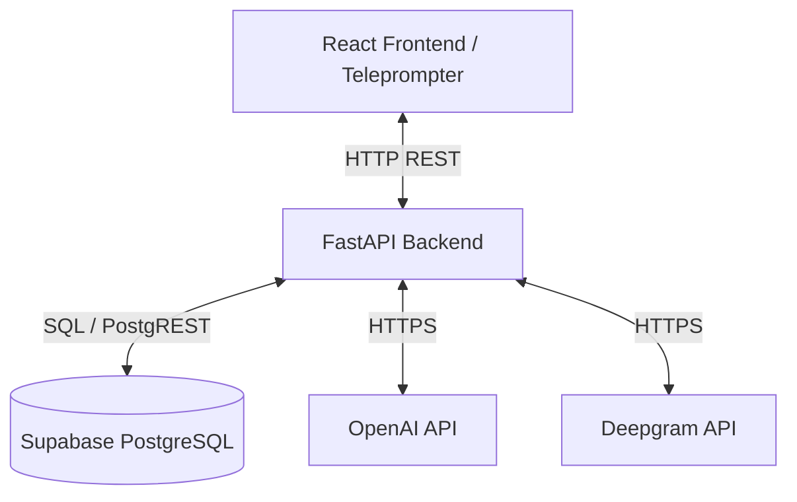
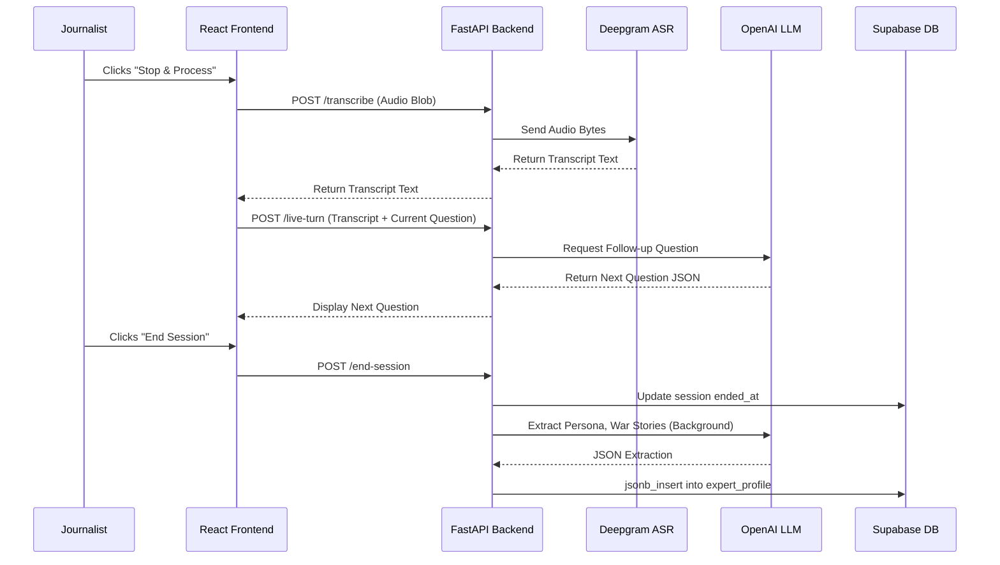
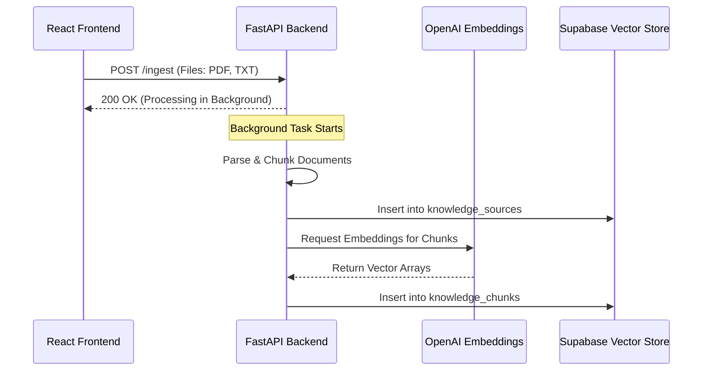

# AI Journalist - Architecture Overview

## 1. High-Level Architecture
The AI Journalist platform is a decoupled, modern web application designed to handle asynchronous AI processing and structured data extraction. 
It follows a standard 3-tier architecture:
- **Presentation Layer (Frontend):** A React single-page application (SPA) acting as the state-driven teleprompter and dashboard.
- **Application Layer (Backend):** A Python FastAPI service responsible for business logic, orchestrating AI calls, and audio processing.
- **Data/Storage Layer:** Supabase (PostgreSQL) acting as the primary relational database and JSONB document store.

## 2. Frontend Architecture
- **Framework:** React with TypeScript, bundled via Vite.
- **State Management:** React local state is used to manage the strict State Machine of the live interview (READY -> PAUSED_RECORDING -> PROCESSING).
- **Audio Capture:** Utilizes the native browser `MediaRecorder` API to capture audio chunks when the user triggers the recording state. 
- **Routing:** Handled client-side via `react-router-dom`.

## 3. Backend Architecture
- **Framework:** FastAPI running on Uvicorn, providing high-performance, asynchronous REST endpoints.
- **AI Orchestration:** Utilizes `LangChain` alongside native `OpenAI` client integrations to manage prompt execution, embeddings, and context window restrictions.
- **Concurrency:** Uses Python's `asyncio` to prevent blocking the main event loop during external API calls (e.g., Deepgram, OpenAI) and FastAPI `BackgroundTasks` for heavy asynchronous jobs (like document ingestion and full-session synthesis).

## 4. Database Architecture
The system uses PostgreSQL hosted on Supabase, specifically leveraging its powerful `JSONB` capabilities to create a hybrid Relational-Document structure.
- `experts`: Relational table storing core metadata.
- `expert_profile` & `curriculum_blueprints`: Heavy reliance on `JSONB` arrays to store extracted, dynamic knowledge (war stories, mental models, syllabi). Updates append to these arrays rather than overwriting.
- `interview_sessions`: Stores session metadata and the raw transcript for audit trails.
- `homework_ledger`: Tracks unclosed loops (AI gaps) and human manual research notes.

## 5. External Integrations
- **OpenAI API (`gpt-4o-mini` & `text-embedding-3-small`):** Core reasoning engine. Generates interview follow-ups, extracts structured data from transcripts, and creates embeddings for RAG document ingestion.
- **Deepgram API (`nova-2` model):** Used for highly accurate, fast speech-to-text transcription of audio blobs sent from the frontend.
- **YouTube Transcript API:** Used during document ingestion to fetch closed captions from external video resources.

## 6. Storage Systems
- **Persistent Storage:** Supabase PostgreSQL handles all structured and semi-structured (JSONB) data.
- **Ephemeral Storage:** The FastAPI backend utilizes the local file system (`tempfile`) temporarily during RAG document ingestion before cleaning up the files.

## 7. Authentication Flow
- The current implementation relies on a pre-configured `SUPABASE_ANON_KEY` to communicate directly with the database from the backend. 
- *Note for scaling:* As the platform matures, standard Supabase JWT-based Row Level Security (RLS) and OAuth flows should be implemented on the frontend to secure API endpoints and tie sessions to specific users.

## 8. Authorization Flow
- Operations are currently role-agnostic on the backend API layer. Access control relies on network-level boundaries (the backend is exposed internally or via specific origins in CORS).

## 9. Real-Time Systems
The platform deliberately avoids WebSockets for the core interview loop to prevent context bloat and hallucination. 
- **Pseudo-Real-Time:** Audio is captured in discrete chunks on the frontend and sent as `Blob` payloads to the `/transcribe` endpoint. Deepgram processes this asynchronously but quickly, returning text to feed the LLM.

## 10. Event-Driven Components
- **Background Task Execution:** When a user uploads documents for RAG ingestion (`/ingest`), the HTTP request returns immediately while a FastAPI `BackgroundTask` chunks the documents, generates OpenAI embeddings, and writes to the Supabase `knowledge_chunks` vector store.
- **Post-Session Synthesis:** Triggering the `/end-session` endpoint kicks off heavy, asynchronous LLM extraction pipelines that map transcripts to database JSONB schemas.

## 11. Third-Party Services
1. **Supabase:** DBaaS for PostgreSQL and Vector storage.
2. **OpenAI:** LLM provider.
3. **Deepgram:** ASR (Automatic Speech Recognition) provider.
4. **LangChain:** Framework for chaining LLM prompts and vector operations.

## 12. Deployment Architecture
- **Containerization:** Both services are containerized using Docker.
- **Orchestration:** `docker-compose.yml` links the `ai-journalist-frontend` (Port 9110) and `ai-journalist-backend` (Port 9120) into a custom Docker network (`10.250.10.0/24`).
- **Health Checks:** The backend container includes strict health checks ensuring the OpenAPI schema is available before the frontend container is marked as healthy.

---

## Architecture Diagrams

### Component Interaction Diagram

### Data Flow: Live Interview Loop (UI to Database)

### Data Flow: Data Ingestion (RAG)

