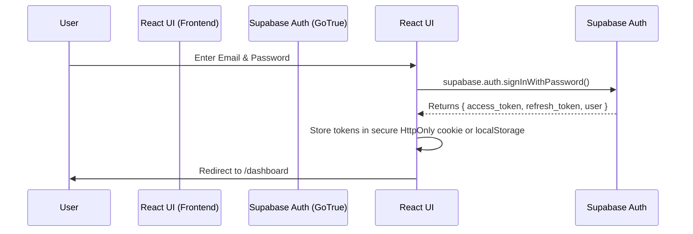
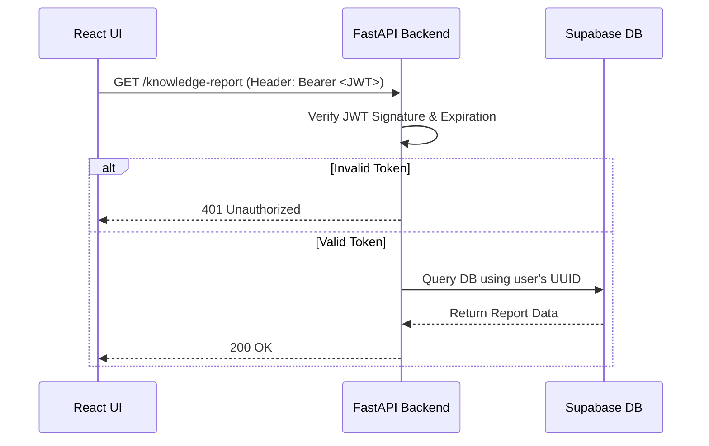

# AI Journalist - Authentication & Authorization Architecture

## ⚠️ Current System State: Prototype Mode
**Important Note:** The current codebase is operating as a rapid-prototype and **does not contain explicit Authentication or Authorization** (OAuth, JWTs, Passwords, or Roles). 
- **Exact Code Location:** `backend/app.py`
- **Implementation Status:** Bypassed. The backend uses the `SUPABASE_ANON_KEY` to directly execute database queries, meaning all API endpoints are entirely open to the public. 

Instead of true authentication, the system uses **Pseudo-Authentication via Local Storage**.

### Current Pseudo-Session Flow
1. User completes intake on `/intake` (`frontend/src/pages/LandingPage.tsx`).
2. Backend generates an `expert_id` and `session_id` and returns them.
3. Frontend saves these identifiers to the browser's `localStorage` (`localStorage.setItem('session_id', data.session_id);`).
4. On subsequent page loads (`InterviewPage.tsx`, `HomeworkPage.tsx`), the frontend reads `localStorage` and appends the `session_id` to API request payloads. 
5. Anyone with the URL and a valid UUID can spoof another expert's session.

---

## 🏗️ Target Production Architecture (Supabase Auth Blueprint)
To transition this app to production, **Supabase Auth** must be implemented. Below is the exact architectural blueprint, sequence diagrams, and permission matrices required to satisfy enterprise security standards using your current tech stack.

### 1. Registration Flow
- **Mechanism:** Supabase GoTrue Service.
- **Proposed Flow:** User signs up via Email/Password or OAuth (Google/GitHub) on the frontend.
- **Frontend Code Target:** `src/components/Auth/Register.tsx` (To be created)
- **Database Trigger Target:** A PostgreSQL trigger on `auth.users` to automatically create a row in the `public.experts` table using the user's `id`.

### 2. Login Flow
- **Mechanism:** User provides credentials. Supabase returns an active Session Object containing `access_token` and `refresh_token`.



### 3. Token Generation
- **Mechanism:** JWT (JSON Web Token) generation is handled entirely by Supabase upon successful login.
- **Payload:** The JWT encodes the user's `sub` (UUID matching the `experts.id`), `email`, and an `aud` (audience).

### 4. Token Validation
- **Mechanism:** FastAPI Dependency Injection.
- **Backend Code Target:** `backend/dependencies.py` (To be created)
- **Process:** Every secured API endpoint must require a `Depends(verify_token)` function. This function intercepts the `Authorization: Bearer <token>` header, verifies the cryptographic signature using the `SUPABASE_JWT_SECRET`, and extracts the user's `expert_id`.



### 5. Session Handling
- **Mechanism:** Supabase Auth handles active sessions on the client side via `@supabase/supabase-js`. 
- **Frontend Code Target:** `src/context/AuthContext.tsx`
- **Process:** The React app wraps the component tree in an `AuthProvider` that listens to `supabase.auth.onAuthStateChange()`. If the session drops, the user is redirected to `/login`.

### 6. Refresh Tokens
- **Mechanism:** Automatic background rotation.
- **Process:** Access tokens (JWTs) expire every 1 hour. Supabase JS automatically intercepts failed requests due to expiration and hits the `/token?grant_type=refresh_token` endpoint to acquire a fresh JWT, ensuring uninterrupted long-running interviews.

---

## 🛡️ Role-Based Access Control (RBAC)

Once Supabase Auth is active, the system should implement Row-Level Security (RLS) policies directly in PostgreSQL to manage authorization.

### 7. Defined Roles
1. **Expert (User):** Can only access, edit, and interview for their own generated `expert_id`.
2. **Journalist (Admin):** Can view all experts, intervene in sessions, and manually edit `homework_ledger` items.

### 8. Permission Matrix

| Resource (`Table`) | Action | `Expert` Role | `Journalist` (Admin) Role | Implementation (Postgres RLS) |
| :--- | :---: | :---: | :---: | :--- |
| `experts` | SELECT | Own Record Only | All Records | `auth.uid() = id` |
| `experts` | UPDATE | Own Record Only | All Records | `auth.uid() = id` |
| `interview_sessions` | SELECT | Own Sessions | All Sessions | `auth.uid() = expert_id` |
| `interview_sessions` | INSERT | Own Sessions | All Sessions | `auth.uid() = expert_id` |
| `homework_ledger` | SELECT | Own Homework | All Homework | `auth.uid() = expert_id` |
| `homework_ledger` | UPDATE | Denied (Read-only) | All Homework | `auth.jwt() ->> 'role' = 'admin'` |
| `knowledge_chunks` | SELECT | Own Embeddings | All Embeddings | Inner join on `sources` |

### Required Code Additions to Enforce Authorization:
**In `production_schema.sql` (Replacing the Dev Policies):**
```sql
-- Secure the courses table so experts only see their own courses
CREATE POLICY "user_can_view_own_courses" 
ON courses FOR SELECT 
USING (auth.uid() = tutor_id);

-- Only Admins (Journalists) can edit the homework notes
CREATE POLICY "admin_can_update_homework"
ON homework_ledger FOR UPDATE
USING ((auth.jwt() ->> 'role')::text = 'admin');
```
