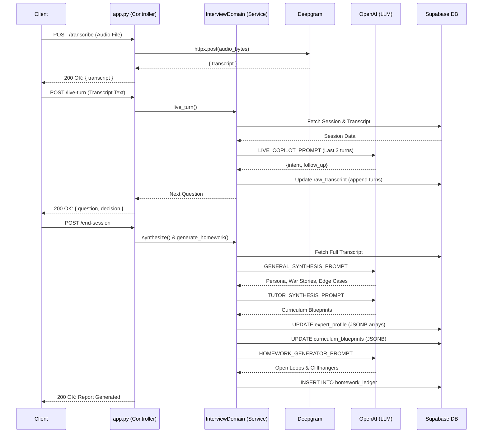

# AI Journalist - Backend Architecture

## Overview
The backend is a robust Python service built with FastAPI. It handles complex orchestration of Large Language Models (LLMs), asynchronous audio transcription, and interactions with a PostgreSQL database (Supabase). It follows a simplified Domain-Driven Design (DDD) pattern, encapsulating business logic away from the API routing layer.

## 1. Folder Structure
```text
backend/
├── app.py                # Core FastAPI application (Controllers & Routers)
├── prompts.py            # Centralized system prompts for OpenAI
├── ingest_data.py        # RAG document chunking and embedding logic
├── requirements.txt      # Python dependencies
├── domains/              # Business logic / Service layer
│   ├── base.py
│   └── interview.py      # Core AI loop, synthesis, and script generation
└── *.sql                 # Database migrations and schema definitions
```

## 2. Controllers
Controllers are defined directly within `app.py` using FastAPI decorators (`@app.post`, `@app.get`). Their primary responsibility is to parse incoming requests, hand off execution to the `InterviewDomain` service, and return formatted JSON responses.

## 3. Services
The core business logic is encapsulated in **Service Classes**, specifically `InterviewDomain` inside `domains/interview.py`. This class manages the 6-Phase AI lifecycle:
- `intake(expert_id)`
- `generate_script(expert_id)`
- `live_turn(session_id, expert_answer)`
- `synthesize(session_id)`
- `generate_homework(session_id)`
- `flywheel_bridge(expert_id)`

## 4. Repositories
The system does not use a traditional ORM (like SQLAlchemy). Instead, it uses the Supabase Python Client (`supabase-py`), which acts as an active record/repository layer, interacting with Postgres via the PostgREST API (e.g., `self.supabase.table("experts").select("*").execute()`).

## 5. Middleware
The only configured middleware is **CORS** (`CORSMiddleware`) in `app.py`, allowing requests from any origin. There is also a unique global monkey-patch of `httpx.AsyncClient` to disable SSL verification to bypass local VPN/Antivirus interference.

## 6. Utilities
- `fetch_youtube_transcript()`: Uses `youtube_transcript_api` to rip captions for ingestion.
- `chunk_by_characters()`: RAG utility for splitting large documents into embedded chunks.

## 7. Validation Layers
Incoming request bodies are validated strictly using **Pydantic Models** inside `app.py`:
- `ExpertIntakeRequest`
- `LiveTurnRequest`
- `HomeworkPutRequest`
Invalid payloads are automatically rejected by FastAPI with a 422 Unprocessable Entity error.

## 8. Authentication
Explicit authentication is bypassed in the current build. The backend utilizes a globally scoped `SUPABASE_ANON_KEY` to read/write to the database without requiring user-specific JWTs. 

## 9. Authorization
No Role-Based Access Control (RBAC) is implemented. All endpoints are open and rely on the frontend to pass valid `expert_id` and `session_id` identifiers.

## 10. Background Jobs
Heavy operations that do not require an immediate client response are offloaded using FastAPI's native `BackgroundTasks`. 
- **Document Ingestion:** The `/ingest` endpoint returns immediately, while `background_ingest_documents` processes file I/O, chunking, and OpenAI embeddings asynchronously.

## 11. Event Handlers
There are no pub/sub or event-driven queues (e.g., Celery/Redis). Processes are triggered synchronously by HTTP endpoints, though executed asynchronously via Python's `asyncio` loop.

## 12. WebSockets
**Explicitly absent.** The system utilizes discrete HTTP POST requests for audio transcription and LLM follow-ups to maintain strict control over the interview state machine and prevent context window exhaustion.

---

## API Endpoints Breakdown

### `POST /intake`
- **Request:** `ExpertIntakeRequest` (JSON)
- **Response:** `{status, expert_id, session_id, icebreaker}`
- **Validation:** Pydantic schema validation.
- **Business Logic:** Calibrates expert archetype, generates day 1 opening script.
- **Database:** Inserts into `experts` and `interview_sessions`.

### `POST /generate-script/{expert_id}`
- **Request:** URL Param `expert_id`
- **Response:** Generated Interview Arc / Script
- **Business Logic:** Pulls accumulated profile and homework gaps to generate dynamic interview themes and questions.
- **Database:** Updates `script` JSONB column in `interview_sessions`.

### `POST /live-turn`
- **Request:** `LiveTurnRequest` (expert answer, current active block)
- **Response:** Next conversational follow-up question and AI intent decision.
- **Business Logic:** Analyzes transcript sliding window. Determines if the expert went on a tangent, resolved the current script question, or if the AI should bridge back.
- **Database:** Appends the human and AI dialogue to the `raw_transcript` text column.

### `POST /transcribe`
- **Request:** `multipart/form-data` (audio blob)
- **Response:** `{transcript}`
- **Business Logic:** Forwards audio bytes to the Deepgram Nova-2 API for high-speed ASR.

### `POST /end-session/{session_id}`
- **Request:** URL Param
- **Response:** `{synthesis, homework}`
- **Business Logic:** **Heavy Computation.** Triggers the LLM to extract persona traits, tacit insights, and Coursera-style curriculum blueprints from the entire raw transcript. Generates the open loops (homework).
- **Database:** Massive updates to JSONB arrays in `expert_profile` and `curriculum_blueprints`. Inserts into `homework_ledger`. Updates session `ended_at`.

### `PUT /homework/{homework_id}`
- **Request:** `HomeworkPutRequest` (Manual Notes string)
- **Response:** Success status
- **Database:** Updates `human_manual_notes` and sets status to `completed`.

### `POST /start-session/{expert_id}`
- **Request:** URL Param
- **Response:** `{session_id, opener}`
- **Business Logic:** Triggers the Flywheel Bridge. Reads manual notes and AI open loops to generate a trust-building opening statement for Day 2.
- **Database:** Inserts new row into `interview_sessions` with incremented `iteration_number`.

### `POST /ingest`
- **Request:** Form-Data with Files (PDF, TXT, DOCX)
- **Response:** Success status (Immediate)
- **Business Logic:** Adds embedding logic to FastAPI Background Tasks.
- **Side Effects:** Temp files created and deleted. Inserts embeddings to Supabase vector DB.

---

## Complete Request Lifecycle Diagram

### The AI Processing Loop (Live Turn & Synthesis)

