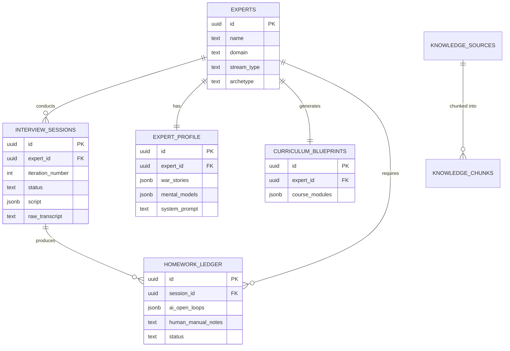
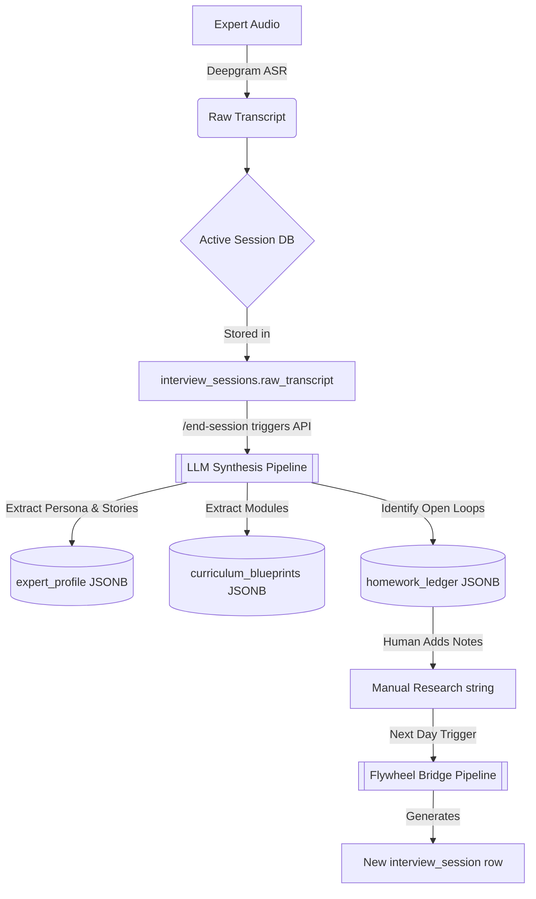

# AI Journalist - Database Architecture

## Overview
The AI Journalist platform utilizes a **PostgreSQL** database hosted on **Supabase**. The architecture uses a hybrid approach: standard relational tables manage core entities and state, while PostgreSQL's powerful `JSONB` columns handle unstructured and highly dynamic AI outputs (like generated scripts, course modules, and tacit insights).

*Note: The system exhibits an evolution from a heavily JSONB-reliant V1 schema (currently active in the FastAPI backend) toward a highly normalized V2 schema (as seen in `production_schema.sql`). This document focuses on the active schema driving the application.*

---

## 1. Active Schema Tables (V1 Hybrid JSON Architecture)

### 1. `experts`
- **Purpose:** Stores the core identity and intake metadata of the domain expert being interviewed.
- **Columns & Data Types:**
  - `id` (UUID, Primary Key)
  - `name` (TEXT)
  - `domain` (TEXT)
  - `stream_type` (TEXT) - e.g., 'tutor' or 'general'
  - `course_title` (TEXT)
  - `target_audience` (TEXT)
  - `expertise_streams` (TEXT[])
  - `years_of_experience` (INT)
  - `short_bio` (TEXT)
  - `archetype` (TEXT) - Calibrated by AI during intake
- **Relationships:** One-to-Many with `interview_sessions`, One-to-One with `expert_profile` and `curriculum_blueprints`.

### 2. `interview_sessions`
- **Purpose:** Tracks the lifecycle, raw transcript, and generated script for a specific interview iteration.
- **Columns & Data Types:**
  - `id` (UUID, Primary Key)
  - `expert_id` (UUID, Foreign Key ➔ `experts.id`)
  - `iteration_number` (INT) - Tracks Day 1, Day 2, etc.
  - `status` (TEXT) - 'active', 'synthesized'
  - `script` (JSONB) - The AI-generated interview arc and themes
  - `raw_transcript` (TEXT) - Turn-by-turn conversation append log
  - `session_synthesis` (JSONB) - Output of Phase 4 processing
  - `ended_at` (TIMESTAMPTZ)
- **Relationships:** Many-to-One with `experts`. One-to-Many with `homework_ledger`.

### 3. `expert_profile`
- **Purpose:** A deeply synthesized, living document of the expert's tacit knowledge. Updated asynchronously after every session.
- **Columns & Data Types:**
  - `id` (UUID, Primary Key)
  - `expert_id` (UUID, Foreign Key ➔ `experts.id`, Unique)
  - `persona_traits` (JSONB)
  - `war_stories` (JSONB)
  - `mental_models` (JSONB)
  - `edge_cases` (JSONB)
  - `pattern_breaks` (JSONB)
  - `tacit_insights` (JSONB)
  - `system_prompt` (TEXT) - The generated AI persona prompt
- **Relationships:** One-to-One with `experts`.

### 4. `curriculum_blueprints`
- **Purpose:** Stores the Coursera-style syllabus extracted from tutor-stream interviews.
- **Columns & Data Types:**
  - `id` (UUID, Primary Key)
  - `expert_id` (UUID, Foreign Key ➔ `experts.id`, Unique)
  - `course_modules` (JSONB) - Array of modules, topics, and rationales
  - `iteration_last_updated` (INT)
- **Relationships:** One-to-One with `experts`.

### 5. `homework_ledger`
- **Purpose:** Bridges Day 1 to Day 2 by tracking AI-identified knowledge gaps and human research notes.
- **Columns & Data Types:**
  - `id` (UUID, Primary Key)
  - `expert_id` (UUID, Foreign Key ➔ `experts.id`)
  - `session_id` (UUID, Foreign Key ➔ `interview_sessions.id`)
  - `iteration_number` (INT)
  - `ai_open_loops` (JSONB)
  - `human_manual_notes` (TEXT)
  - `status` (TEXT) - 'pending', 'completed'
  - `created_at` (TIMESTAMPTZ)
- **Relationships:** Many-to-One with `experts` and `interview_sessions`.

### 6. Vector RAG Tables (`knowledge_sources` & `knowledge_chunks`)
- **Purpose:** Stores document embeddings for Retrieval-Augmented Generation context.
- **Columns:**
  - `knowledge_sources`: `id` (UUID), `source_type` (TEXT), `title` (TEXT).
  - `knowledge_chunks`: `id` (UUID), `source_id` (UUID, FK), `content` (TEXT), `embedding` (VECTOR 1536).
- **Indexes:** IVFFlat or HNSW vector index on the `embedding` column for semantic similarity search (`<=>`).

---

## Relationship Explanations

- **One-to-One (1:1):** 
  - `experts` ➔ `expert_profile`
  - `experts` ➔ `curriculum_blueprints`
  - *Why:* An expert has exactly one accumulated profile and one curriculum blueprint that is continuously enriched (appended to) over multiple sessions.
- **One-to-Many (1:N):**
  - `experts` ➔ `interview_sessions`
  - `interview_sessions` ➔ `homework_ledger`
  - *Why:* An expert can have multiple interview iterations (Day 1, Day 2). Each session generates a specific homework ledger to bridge to the next session.
- **Many-to-Many (N:M):**
  - Not explicitly mapped via associative tables in the V1 schema. The heavy use of `JSONB` arrays handles what would traditionally be N:M mappings (e.g., tags, themes to questions).

---

## Entity Relationship (ER) Diagram

---

## Data Flow Diagram: Lifecycle of Knowledge

This diagram illustrates how unstructured dialogue transforms into structured relational data and JSONB nodes.

## How Data Moves Between Tables
1. **Intake:** Data enters `experts`. A new row is immediately created in `interview_sessions` for Iteration 1.
2. **Execution:** As the interview runs, `app.py` continuously appends strings to `interview_sessions.raw_transcript`.
3. **Synthesis (The Great Migration):** When the session ends, the monolithic transcript is read into the LLM. The LLM chunks it into structured categories. 
4. **Distribution:** The backend takes the LLM JSON output and runs multiple SQL `UPDATE` / `INSERT` commands to distribute the knowledge:
   - Traits and stories update arrays in `expert_profile`.
   - Syllabus data updates arrays in `curriculum_blueprints`.
   - Missing info inserts a new row in `homework_ledger`.
5. **Re-Initialization:** On Day 2, data flows *out* of `homework_ledger` to feed the LLM, generating the next row in `interview_sessions`.
