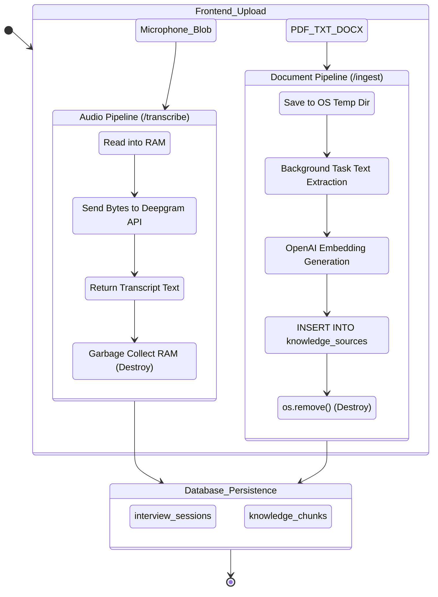

# AI Journalist - File Management Architecture

## ⚠️ Architectural Context: Ephemeral Processing System
The AI Journalist platform **does not operate a traditional persistent file management system**. There is no "file browser," no integration with AWS S3 or Supabase Storage buckets, and no folder hierarchy. 

Instead, the platform operates entirely on an **Ephemeral Data Processing Pipeline**. Files (such as microphone audio blobs and PDF syllabi) are uploaded strictly for immediate processing (transcription or RAG vectorization). Once the data is extracted, the physical file is immediately **destroyed**.

Below is an analysis of the requested mechanisms based on the current system behavior.

---

## 1. Upload Flow
There are two distinct upload pipelines in the application:

### A. The Audio Upload Pipeline (`/transcribe`)
- **Mechanism:** The frontend captures microphone audio using the MediaRecorder API and posts it as a `multipart/form-data` blob to the backend.
- **Handling:** The FastAPI backend reads the blob directly into memory (`await audio.read()`).
- **Execution:** The bytes are forwarded to the Deepgram API via HTTPX.
- **Destruction:** The audio is never saved to disk. It is immediately garbage collected from RAM once Deepgram returns the text.

### B. The Document RAG Pipeline (`/ingest`)
- **Mechanism:** The user uploads a batch of files (TXT, DOCX, PDF) via `multipart/form-data`.
- **Handling:** FastAPI streams the files into standard Python temporary files (`tempfile.mkstemp()`) to avoid RAM exhaustion on massive PDFs.
- **Execution:** A `BackgroundTask` spins up, reads the temp files (using `fitz` for PDFs, `python-docx` for Word), extracts the text, chunks it, and creates vector embeddings via OpenAI.
- **Destruction:** The background task explicitly runs `os.remove(fp)` on the temp files once extraction is complete.

## 2. Download Flow
**Not Implemented.** Because all files are destroyed immediately after text extraction, there are no files available for users to download.

## 3. Preview Flow
**Not Implemented.** The system extracts text. It does not generate thumbnails or offer a UI to preview PDF visual layouts or listen to past audio recordings.

## 4. Storage Provider Integrations
- **AWS S3 / GCS / Azure:** None.
- **Supabase Storage:** Not utilized, despite Supabase being used for the database.
- **Local Filesystem:** Used purely as a temporary cache (`/tmp` or `%TEMP%`) during the `/ingest` background task.

## 5. Folder Creation Logic
**Not Implemented.** The system does not possess a hierarchical filesystem for users.

## 6. Access Control & 7. Permission Management
**Not Implemented.** Because files are ephemeral and destroyed in milliseconds/seconds, there is no file-level Access Control List (ACL). Access to the extracted *data* (the database rows) falls under the Database Authorization matrix (currently prototype/open).

## 8. Metadata Storage
While the physical files are deleted, **Document Metadata** is stored persistently in the database to provide citations for the RAG system.

- **Table:** `knowledge_sources`
- **Stored Metadata:**
  - `source_type`: (e.g., 'document', 'youtube')
  - `title`: The original filename (e.g., `syllabus_v2.pdf`)
  - `author_or_channel`: "User Upload"
  - `global_summary`: E.g., "Uploaded document for session {uuid}"
- **Storage Mapping:** The metadata acts as a parent row for the thousands of `knowledge_chunks` (vector embeddings) extracted from the destroyed file.

---

## Complete File Lifecycle Diagram

This diagram maps out the strict "Process and Destroy" lifecycle for both Audio and Document uploads.

