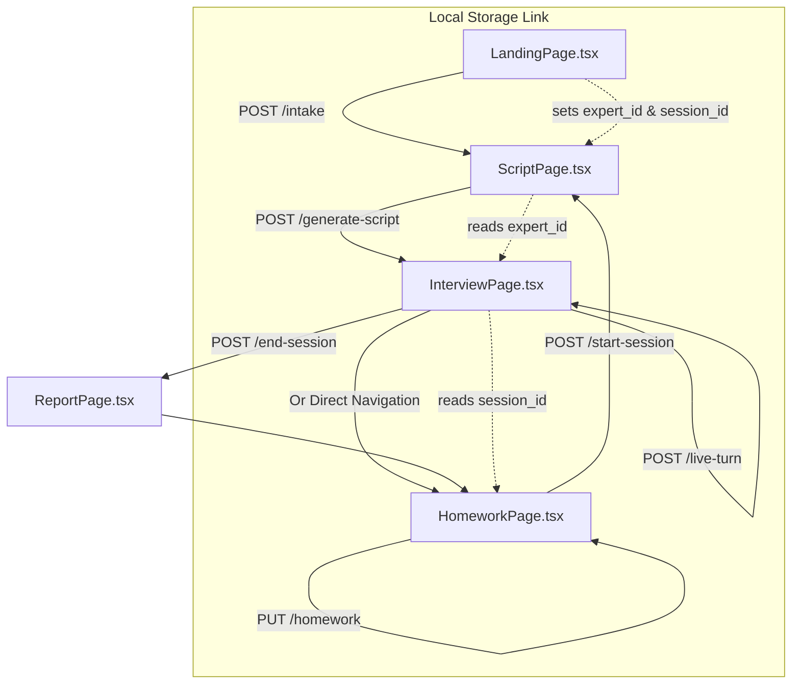

# AI Journalist - Frontend Architecture

## Overview
The frontend is a lightweight React Single Page Application (SPA) built with TypeScript and bundled via Vite. It focuses on high-fidelity UI interactions and strict local state management to handle the complex flow of a live interview.

## 1. Folder Structure
The architecture intentionally follows a **"Flat Page-Component"** structure rather than a deeply nested module pattern.
```text
frontend/src/
├── App.tsx             # Root router configuration
├── index.css           # Global design system & utility classes
├── assets/             # Static images/icons
└── pages/              # Monolithic page components
    ├── LandingPage.tsx
    ├── ScriptPage.tsx
    ├── InterviewPage.tsx
    ├── ReportPage.tsx
    └── HomeworkPage.tsx
```

## 2. Routing Architecture
Routing is managed client-side using `react-router-dom`. The `App.tsx` acts as the sole routing layer without nested routes.
- `/` ➔ Landing & Intake
- `/script` ➔ Generated Interview Script
- `/interview` ➔ Live Audio Capture & Teleprompter
- `/report` ➔ Post-Session Tacit Knowledge Report
- `/homework` ➔ Asynchronous Research & Day 2 Prep

## 3. Layout Architecture
There is no global `<Layout>` wrapper. Each page component in the `pages/` directory is responsible for its own structural layout (navbars, sidebars, footers). This prevents re-render thrashing across deeply nested layout trees during heavy live-interview state changes.

## 4. State Management
- **Local Component State:** Exclusively utilizes React's `useState`, `useEffect`, and `useRef`. There is no Redux, Zustand, or MobX.
- **Cross-Page Persistence:** Uses the browser's `localStorage` to pass lightweight identifiers (`expert_id`, `session_id`, `icebreaker`) between pages without requiring a complex global state provider.

## 5. API Communication Layer
Direct native `fetch` API calls are executed inside component event handlers and `useEffect` hooks. There is no abstracted service layer (e.g., Axios instances or React Query).
- Responses are handled via `async/await`.
- Requests expect JSON payloads and target `http://localhost:9120`.

## 6. Reusable Components
Currently, the application relies on inline HTML/JSX for components. The primary form of reuse comes from **Lucide React** icons (`<BrainCircuit />`, `<Mic />`, etc.) and global CSS utility classes defined in `index.css` (e.g., `.btn-primary`, `.btn-ghost`).

## 7. Custom Hooks
None. All side-effects and API interactions are tightly coupled to their respective page components.

## 8. Context Providers
None. Avoiding React Context prevents unnecessary cross-app re-renders, which is critical during the live audio recording loop.

## 9. Forms
Forms (such as the Expert Setup in `LandingPage.tsx`) use **Controlled Components**. Input values are bound directly to a single `useState` object (`tutorProfile`), updating via `onChange` handlers.

## 10. Validation
- **Client-Side:** Relies on native HTML5 validation attributes (`required`, `min`) and simple string trimming (`!text.trim()`).
- **Submission Guarding:** Buttons are disabled (`disabled={isSubmitting}`) while API calls are in flight.

## 11. Authentication Handling
No explicit user authentication (JWT/OAuth) is currently implemented on the frontend. "Sessions" are tracked implicitly via the `expert_id` and `session_id` stored in `localStorage` upon completing the intake form.

## 12. Error Handling
Errors are caught via basic `try/catch` blocks surrounding `fetch` calls. Failures log to the console (`console.error`) and present native browser alerts (`alert()`) to the user.

---

## Page-by-Page Breakdown

### 1. LandingPage.tsx (`/`)
- **Purpose:** Intake new experts or select a knowledge domain for document ingestion.
- **Components Used:** Intake Form, Domain Select Cards.
- **APIs Consumed:** `POST /intake`
- **User Actions:** Fill out Expert metadata, select "Tutor" vs "IT Pro", submit form.
- **State Updates:** Updates `tutorProfile` object, sets `view` mode, toggles `isSubmittingProfile`. Writes to `localStorage`.

### 2. ScriptPage.tsx (`/script`)
- **Purpose:** Display the generated Day 1 interview script and themes before going live.
- **Components Used:** Animated Loading Steps, Theme Sidebar, Expandable Question Cards.
- **APIs Consumed:** `POST /generate-script/:expertId`
- **User Actions:** Expand/collapse themes and question rationales. Click "Launch Interview".
- **State Updates:** Tracks `researchStep` for UI animations, stores `script` and `themes` arrays, tracks `expandedThemes` and `expandedQuestions` sets.

### 3. InterviewPage.tsx (`/interview`)
- **Purpose:** The core live teleprompter and chat interface.
- **Components Used:** Chat Feed, AI Decision Log, Live Script Sidebar, Audio Input Bar.
- **APIs Consumed:** `GET /session/:sessionId`, `POST /live-turn`, `POST /end-session/:sessionId`.
- **User Actions:** Toggle microphone, send text responses, toggle AI decision logs, navigate script blocks, click "End Session".
- **State Updates:** Appends to `messages` array, tracks `tangentCount`, `activeBlock`, and `showDecision` UI toggles.

### 4. ReportPage.tsx (`/report`)
- **Purpose:** Display the post-interview tacit knowledge extraction results.
- **Components Used:** Metric Cards, Synthesis Blocks.
- **APIs Consumed:** Currently uses mock data in `useEffect`. (To be connected to GET report endpoint).
- **User Actions:** Review extracted metrics, navigate to Homework Dashboard.
- **State Updates:** Sets `knowledgeReport` object on mount.

### 5. HomeworkPage.tsx (`/homework`)
- **Purpose:** Display AI-identified open loops and allow manual human research to bridge Day 1 to Day 2.
- **Components Used:** Priority Cards, Manual Notes Textarea, Flywheel Bridge Trigger.
- **APIs Consumed:** `GET /homework/:expertId`, `PUT /homework/:homeworkId`, `POST /start-session/:expertId`.
- **User Actions:** Type manual notes, click "Trigger Flywheel Bridge".
- **State Updates:** Tracks `manualNotes` text, manages complex `generationPhase` ('idle' -> 'loading' -> 'typing' -> 'done') for the typewriter effect.

---

## Page Dependency Map


