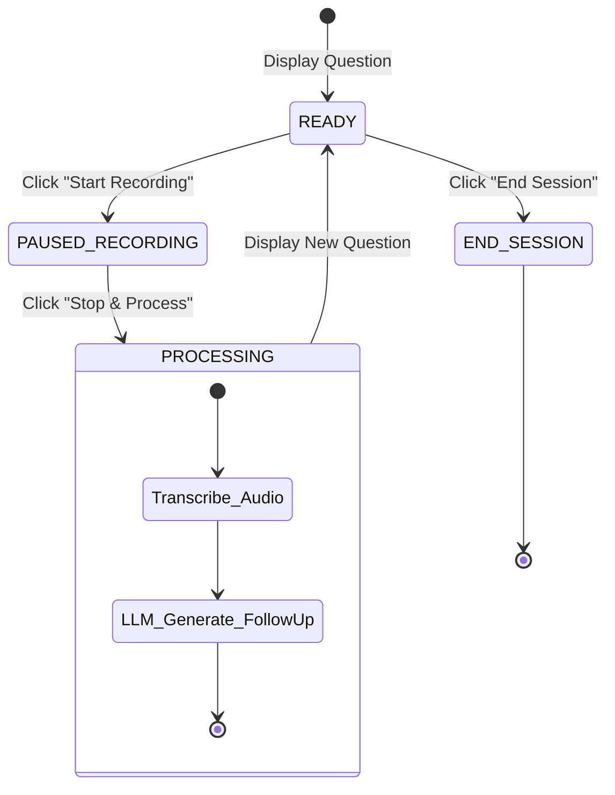
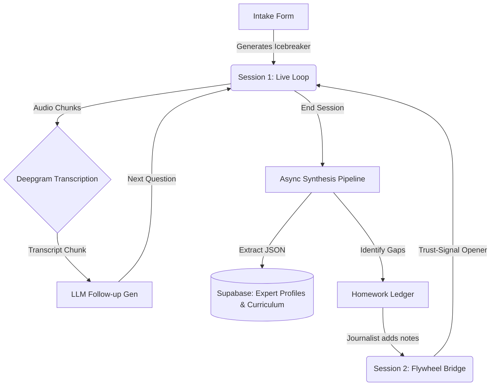

# AI Journalist - Product Overview

## 1. Product Vision
The AI Journalist platform is designed to revolutionize how tacit knowledge is extracted from industry experts. It moves beyond traditional, continuous-streaming conversational AI chatbots by acting as a **state-driven interview teleprompter**. By decoupling live human conversation from AI processing and utilizing asynchronous, offline LLM synthesis, the platform prevents context bloat, minimizes hallucinations, and transforms messy, long-form interviews into highly structured, actionable knowledge bases and curriculum blueprints.

## 2. Business Problem Being Solved
Extracting deep, unwritten rules and "war stories" from experts is traditionally a chaotic and unstructured process. 
- **Context Bloat:** Standard AI systems struggle to maintain context over long conversations, leading to forgotten details or hallucinations.
- **Cognitive Overload:** Interviewers struggle to simultaneously listen actively, process complex technical answers, and formulate the perfect follow-up question in real-time.
- **Knowledge Loss:** Raw interview transcripts are dense and difficult to parse. Valuable tacit knowledge is often lost in conversational filler.
The AI Journalist solves this by guiding the interviewer step-by-step, analyzing audio chunks asynchronously, and distilling full transcripts into structured JSON data (expert profiles and syllabi) without relying on massive, fragile prompt histories.

## 3. Target Users
1. **The Journalist / Host:** The primary user of the application. They operate the teleprompter, conduct the interview, manage the recording state, and review AI-generated "homework" between sessions.
2. **The Expert / Tutor:** The subject matter expert being interviewed. They do not interact with the software directly; they simply converse with the Journalist.

## 4. User Roles and Permissions
- **Journalist (Admin Role):** Full access to the platform. Can create new Expert profiles, start/stop recording sessions, trigger AI processing, access the knowledge extraction dashboards, and write manual research notes.
- **System Backend (Background Worker):** Operates asynchronously to transcribe audio via Deepgram, communicate with OpenAI for prompt generation and synthesis, and update the Supabase database.

## 5. Core Modules

### Module 1: The Database Foundation
- **Purpose:** Replaces raw chat history with structured memory. It stores extracted concepts instead of thousands of words of dialogue.
- **Users involved:** System Backend.
- **Inputs:** Extracted JSON data from the LLM.
- **Outputs:** Persistent, structured JSONB storage in Supabase.
- **Dependencies:** PostgreSQL (Supabase).

### Module 2: The Intake Flow
- **Purpose:** Initial onboarding of an expert to generate a customized "Day 1 Interview Strategy" and Icebreaker question.
- **Users involved:** Journalist.
- **Inputs:** Expert Name, Domain, Stream Type (General or Tutor).
- **Outputs:** A new Expert record in the database and an AI-generated opening question.
- **Dependencies:** React Frontend, Node.js Backend, LLM.

### Module 3: The Live Interview Loop (State Machine)
- **Purpose:** Controls the flow of audio capture and question generation during the interview, keeping the LLM completely idle during active speaking to prevent lag.
- **Users involved:** Journalist, Expert.
- **Inputs:** Audio captured via the browser's MediaRecorder API.
- **Outputs:** Transcribed text (via Deepgram) and the next logical follow-up question (via LLM) displayed on the teleprompter.
- **Dependencies:** Deepgram API, OpenAI API, React State Machine.

### Module 4: Post-Session Asynchronous Synthesis
- **Purpose:** A background pipeline that reads the full day's messy transcript and extracts structured knowledge (persona traits, war stories, mental models, edge cases, and course modules).
- **Users involved:** System Backend.
- **Inputs:** Full raw session transcript.
- **Outputs:** Appended data to the `expert_profile` and `curriculum_blueprints` JSONB arrays in the database.
- **Dependencies:** LLM Universal Extraction Prompts.

### Module 5: The Hybrid Homework Ledger
- **Purpose:** Identifies "Open Loops" (topics mentioned but not fully explained) and provides a dashboard for the Journalist to manually research or correct gaps between sessions.
- **Users involved:** Journalist, System Backend.
- **Inputs:** Extracted Session Data.
- **Outputs:** A list of AI-identified open loops and a text area for Human Manual Notes.
- **Dependencies:** Supabase `homework_ledger` table.

### Module 6: Day 2+ Flywheel Bridge
- **Purpose:** Generates a highly specific opening question for subsequent interview sessions based *only* on the Homework Ledger, proving to the expert that the system "remembered" yesterday's conversation without loading the entire raw transcript.
- **Users involved:** Journalist.
- **Inputs:** Validated Homework Ledger (AI Gaps + Human Notes).
- **Outputs:** A "Trust-Signal Opener" question.
- **Dependencies:** LLM Flywheel Bridge Prompt.

## 6. How Users Interact with the Platform
The Journalist interacts entirely through a **React-based Web UI**.
- **Dashboard:** They view existing experts, review knowledge reports, and check the Homework Ledger.
- **Teleprompter Interface:** During an interview, the UI acts as a teleprompter. It prominently displays the current question. The Journalist uses primary action buttons to control the state: **"Start Recording"**, **"Stop & Process"**.
- **Homework View:** Between sessions, the Journalist logs in to review AI-generated knowledge gaps and types in manual research notes to prep for the next day.

## 7. End-to-End User Journey
1. **Onboarding:** Journalist enters Expert details into the Intake Form.
2. **Session 1 Kickoff:** The system generates an Icebreaker question. The Journalist reads it, clicks "Start Recording", and the Expert answers.
3. **Iterative Interviewing:** The Journalist clicks "Stop & Process". The audio is transcribed, sent to the LLM, and a highly contextual follow-up question appears on screen. This loops until the interview is over.
4. **Conclusion:** Journalist clicks "End Session".
5. **Async Processing:** In the background, the system synthesizes the entire transcript into structured data and flags missing information (Open Loops).
6. **Preparation:** The Journalist reviews the Open Loops in the Homework Ledger and adds manual notes.
7. **Session 2 Kickoff:** The system uses the Homework Ledger to generate a Trust-Signal Opener, seamlessly bridging the gap between sessions.

## 8. Major Workflows

### Live Interview Loop Workflow

### End-to-End System Architecture Workflow

## 9. Product Lifecycle
The platform treats knowledge extraction as an iterative lifecycle rather than a one-off event. An Expert's profile begins as a blank slate and is progressively enriched across multiple sessions. As the database accumulates "war stories" and "edge cases", the curriculum blueprints become increasingly dense and valuable. The lifecycle ends when the system identifies zero remaining "Open Loops" for the target domain, meaning the expert's knowledge has been fully mapped.

## 10. Business Rules and Constraints
- **Strict State Management:** The UI must strictly follow the READY -> PAUSED_RECORDING -> PROCESSING state machine. No background LLM processing occurs while the microphone is hot.
- **No Chat History Bloat:** The LLM must *never* be fed the entire raw transcript during the live interview loop. It only receives the most recent transcribed chunk.
- **Append-Only Knowledge:** Database functions must append to JSONB arrays (e.g., using `jsonb_insert`), never overwriting existing expert knowledge.
- **Flywheel Constraint:** Day 2+ bridging prompts must *only* read from the Homework Ledger, never from previous raw transcripts.
- **Asynchronous Heavy Lifting:** Full-session synthesis (Phase 4) must be handled asynchronously via background workers to prevent blocking the main application thread.
