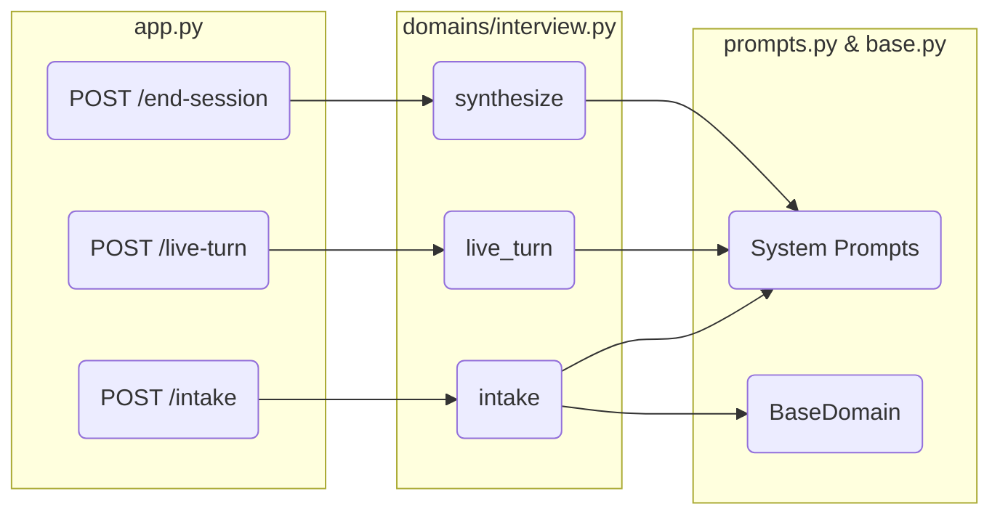
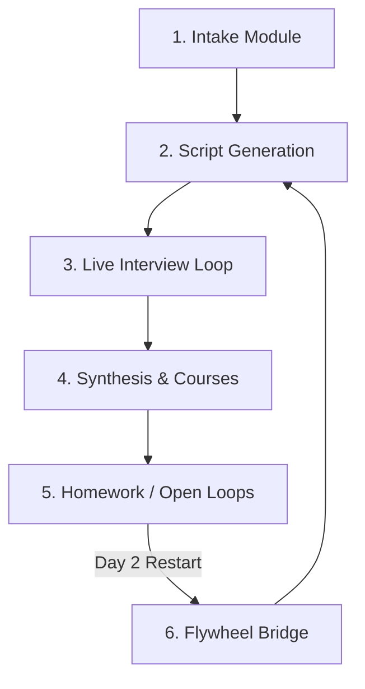
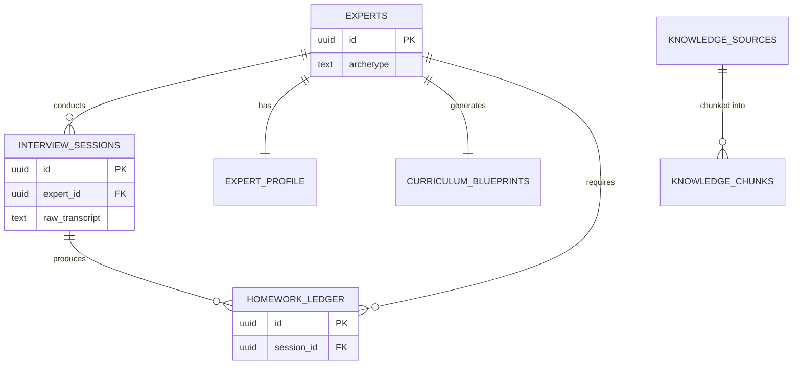
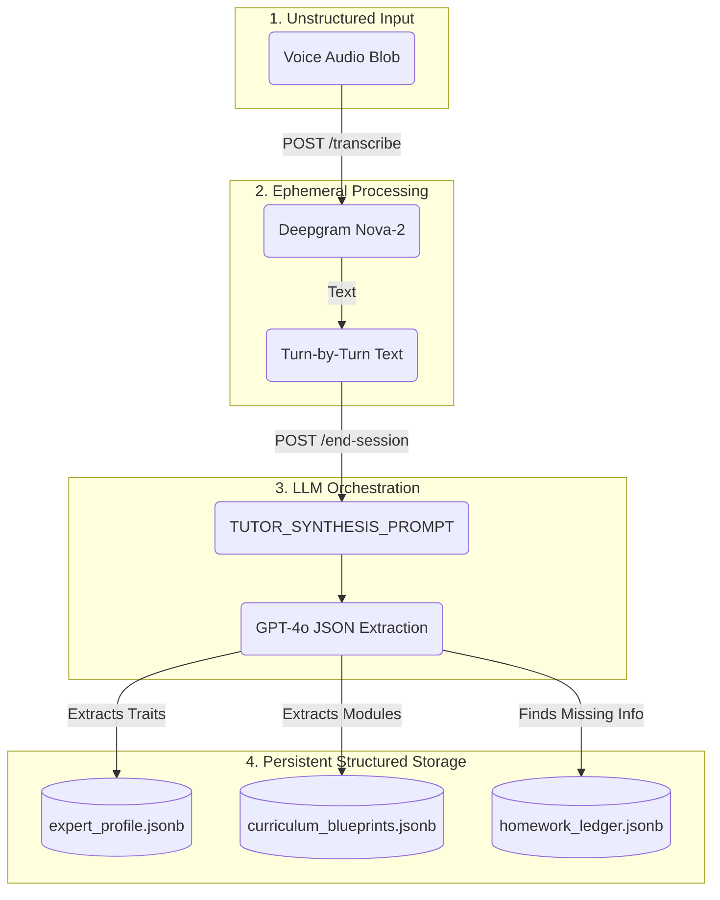

# AI Journalist - Developer Onboarding & Knowledge Graph

Welcome to the AI Journalist platform! This document serves as the **Single Source of Truth** for onboarding new engineers. It maps the entire ecosystem, showing exactly how modules, APIs, databases, and user journeys interconnect.

---

## 1. System Map (High-Level Topology)
This map illustrates the physical distribution of the system components.

```mermaid
graph TD
    subgraph Frontend [React SPA (Vite)]
        UI[User Interface]
        State[Local Storage Session State]
    end

    subgraph Backend [FastAPI Service]
        API[HTTP Endpoints]
        Domain[Interview Domain Logic]
        LLM_Client[LangChain / OpenAI]
        ASR_Client[Deepgram HTTPX]
    end

    subgraph External Services
        Supabase[Supabase PostgreSQL]
        Deepgram[Deepgram Nova-2 API]
        OpenAI[OpenAI GPT-4o / Embeddings]
    end

    UI <-->|HTTP JSON / FormData| API
    API --> Domain
    Domain <--> LLM_Client
    API <--> ASR_Client
    
    LLM_Client <-->|REST| OpenAI
    ASR_Client <-->|WSS/REST| Deepgram
    Domain <-->|PostgREST| Supabase
```

---

## 2. Architecture Map (Service Dependencies)
This maps the internal architectural layers of the backend and how they depend on each other.



---

## 3. Module Map (Module Dependencies)
The system is divided into logical modules. Here is how they depend on each other linearly.



---

## 4. User Journey Dependencies
How a user navigates the frontend, and the corresponding API triggers required to advance state.

| User Action | UI Component | API Dependency | State Mutation | Next Step |
| :--- | :--- | :--- | :--- | :--- |
| **Fills Form** | `LandingPage.tsx` | `POST /intake` | sets `session_id` in `localStorage` | Redirect to Interview |
| **Starts Recording** | `InterviewPage.tsx` | `POST /generate-script` | fetches AI script into UI state | AI speaks first line |
| **Stops Speaking** | `InterviewPage.tsx` | `POST /transcribe` | extracts text from audio blob | Submits text to LLM |
| **AI Responds** | `InterviewPage.tsx` | `POST /live-turn` | appends turn to transcript DB | Wait for user to speak |
| **Clicks End** | `InterviewPage.tsx` | `POST /end-session` | generates massive synthesis DB update | Redirect to Dashboard |
| **Views Dashboard**| `DashboardPage.tsx` | `GET /knowledge-report` | renders course UI | Review Syllabus |
| **Reviews Gaps** | `HomeworkPage.tsx` | `PUT /homework` | saves manual notes | Click "Start Day 2" |

---

## 5. API Dependencies (The Endpoint Chain)
APIs cannot be called arbitrarily. They rely on database states established by preceding APIs.

```mermaid
graph TD
    A[POST /intake] -->|Generates expert_id| B(POST /generate-script/{expert_id})
    A -->|Generates session_id| C(GET /session/{session_id})
    B --> C
    
    C -->|Provides Context for| D(POST /live-turn)
    
    D -->|Loops N Times| D
    
    D -->|Final Transcript feeds| E(POST /end-session/{session_id})
    
    E -->|Generates Report for| F(GET /knowledge-report/{expert_id})
    E -->|Generates Homework for| G(GET /homework/{expert_id})
    
    G -->|Resolves Gaps via| H(PUT /homework/{homework_id})
    
    H -->|Feeds Context to| I(POST /start-session/{expert_id})
    I -->|Restarts Loop at| B
```

---

## 6. Database Dependencies (Entity Graph)
The active V1 schema relies heavily on `experts` as the root node.



---

## 7. Data Flow Map (Lifecycle of Knowledge)
This illustrates the flow of raw, unstructured audio into deeply structured Coursera-style syllabus JSON.



---

## Developer Cheat Sheet
- **Framework:** React (Vite) + FastAPI (Python 3.x).
- **Database:** Supabase PostgreSQL (PostgREST API, no ORM).
- **Authentication:** None (Pseudo-auth via `localStorage` holding `session_id`).
- **File Storage:** None. Audio and Docs are processed ephemerally and garbage-collected/deleted.
- **LLM Strategy:** Heavily reliant on strict JSON output prompts (`prompts.py`) to bypass hallucination.
- **Run Local:** `npm run dev` (Frontend on port 9110), `python app.py` (Backend on port 9120).
